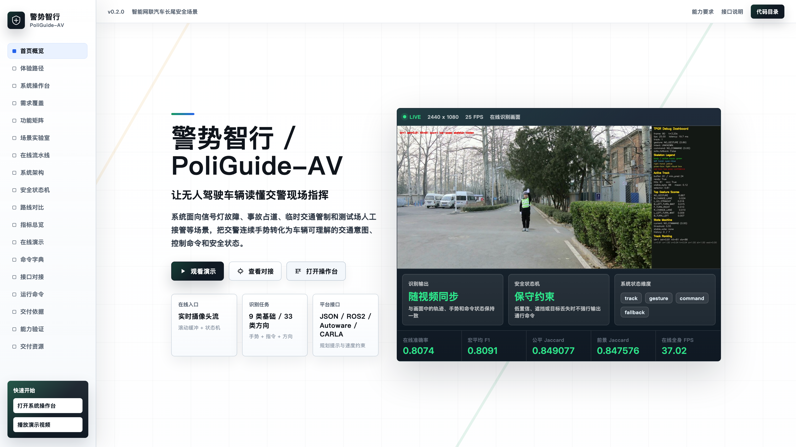

<p align="center">
  
</p>

<h1 align="center">警势智行 / PoliGuide-AV</h1>

<p align="center">
  面向无人驾驶的交警手势识别与指令解析系统
</p>

<p align="center">
  <a href="showcase/index.html"><strong>前端展示页</strong></a>
  ·
  <a href="processed_demo_videos/最终提交.mp4"><strong>提交版演示视频</strong></a>
  ·
  <a href="showcase_uhd_screenshots/manifest.json"><strong>高清截图清单</strong></a>
  ·
  <a href="code/ai_upload_package_gt200mb_with_results/"><strong>工程代码</strong></a>
</p>

<p align="center">
  
  
  
  
  
</p>

## 项目概述

PoliGuide-AV 聚焦智能网联汽车在信号灯故障、事故占道、临时交通管制、施工绕行、检查点接管和测试场人工接管等场景中的人工交通指挥理解问题。系统将交警连续手势从视频流中解析为车辆可理解的交通意图、控制命令、安全状态和结构化接口消息，使自动驾驶系统能够在非标准交通秩序下获得清晰、稳定、可复核的人工指令。

项目不是单帧手势分类演示，而是围绕真实使用链路构建的完整系统：输入视频或摄像头画面后，系统完成主体检测、姿态估计、时序识别、命令映射、状态机过滤、可视化叠加、JSONL 记录、接口消息生成和交付验证。仓库同时包含产品级前端展示页面、真实演示视频、高清截图、处理脚本、模型资源和工程源码，便于评审、复现、展示和二次集成。

## 主要能力

| 能力模块 | 内容 |
| --- | --- |
| 实时摄像头推理 | 支持摄像头输入、主体选择、骨架叠加、命令输出和在线 JSONL 记录 |
| 离线视频推理 | 对视频文件生成带识别叠加的 MP4，并同步输出逐帧 JSONL 结构化结果 |
| 连续手势理解 | 面向连续帧进行时序建模，避免只依赖单帧姿态造成的抖动 |
| 安全状态机 | 通过窗口投票、置信度阈值、命令保持、过期清空和回退策略抑制误触发 |
| 车辆指令解析 | 将手势映射为 `STOP`、`GO_STRAIGHT`、`TURN_LEFT`、`TURN_RIGHT`、`SLOW_DOWN` 等车辆语义命令 |
| 多平台对接 | 提供 JSON、ROS2、Autoware 速度约束和 CARLA planner hint 的字段展示与适配思路 |
| 可视化诊断 | 输出主体框、COCO17 骨架、动作标签、命令状态、姿态质量、延迟和安全状态 |
| 交付展示 | 内置前端操作台、指标看板、接口校验器、JSONL 解析器、截图集和最终演示视频 |

## 展示入口

仓库中的展示前端位于 [`showcase/`](showcase/)。它是静态 HTML/CSS/JavaScript 页面，不需要额外构建步骤。由于页面会引用仓库根目录下的视频、截图和展示资产，建议在仓库根目录启动本地静态服务：

```bash
python3 -m http.server 8765 --bind 127.0.0.1
```

随后访问：

```text
http://127.0.0.1:8765/showcase/
```

展示页覆盖以下内容：

- 首页概览：项目定位、核心指标、实时演示控制台。
- 系统操作台：运行配置生成、接口消息校验、JSONL 解析和上线检查。
- 需求覆盖：从场景、功能、接口、指标、交付和边界逐项对应系统设计。
- 场景实验室：信号灯故障、事故占道、施工绕行、检查点接管、多人干扰等典型场景。
- 在线流水线：从视频输入到安全状态输出的十步处理链路。
- 系统架构：输入层、感知层、时序层、解析层、输出层。
- 安全状态机：低置信、遮挡、目标丢失和短时不确定时的稳定输出策略。
- 指标总览：公平 split、在线部署、wholebody 和 all-data 不同口径的性能说明。
- 在线演示：在线、离线、实拍场景和提交版总览视频。
- 命令字典：手势标签、交通语义、车辆控制命令和平台侧处理方式。
- 接口对接：JSON、ROS2、Autoware、CARLA 的消息示例。
- 运行命令：训练、评估、摄像头推理、离线视频、诊断、ONNX 导出等入口。

## 演示视频与截图

| 资源 | 路径 | 说明 |
| --- | --- | --- |
| 提交版总览视频 | [`processed_demo_videos/最终提交.mp4`](processed_demo_videos/最终提交.mp4) | 无声 1080p 总览片，覆盖夜间眩光、施工入口、路侧车辆、逆光和正面指挥等实拍场景 |
| 在线演示 | [`在线演示.mp4`](在线演示.mp4) | 展示摄像头链路下的实时输入、主体选择、识别叠加和诊断面板 |
| 离线演示 | [`离线演示.mp4`](离线演示.mp4) | 展示视频文件推理、输出视频和 JSONL 结果解释 |
| 实拍演示集 | [`processed_demo_videos/`](processed_demo_videos/) | 7 个实拍场景视频、poster、JSONL、帧级审核图和对齐检查图 |
| 高清截图集 | [`showcase_uhd_screenshots/`](showcase_uhd_screenshots/) | 84 张 4K 截图，覆盖前端主区块、操作台模式、工具状态、场景、路线、32 个接口组合、运行命令和完整视频演示区 |

演示视频采用同一处理链路生成，画面中同时呈现主体框、骨架、手势标签、车辆命令、姿态质量、延迟、命令一致率和安全状态，便于直接观察实际动作与识别输出之间的对应关系。

## 核心指标

展示页和实验结果中区分不同评测口径，避免把公平对标、部署主线和容量上限混为一谈：

| 口径 | 指标 | 数值 |
| --- | --- | --- |
| 公平 split | gesture macro Jaccard | `0.849077` |
| 公平 split | foreground macro Jaccard | `0.847576` |
| 公平 split | command macro Jaccard | `0.843301` |
| 在线 wholebody | system FPS estimate | `37.02` |
| all-data 上限 | gesture macro Jaccard | `0.890252` |
| 论文公开基线 | Jaccard baseline | `0.842` |

其中公平 split 用于对标说明，在线 wholebody 用于部署体验说明，all-data 上限只反映模型容量和数据利用上限，不替代公平测试结论。

## 工程目录

```text
.
├── code/ai_upload_package_gt200mb_with_results/   # Python 工程源码、配置、训练评估结果与运行入口
├── showcase/                                      # 产品级前端展示页面
├── showcase_uhd_screenshots/                     # 84 张前端各页面与交互状态的超高清截图
├── processed_demo_videos/                        # 处理后的演示视频、JSONL、poster、审核帧与总览视频
├── models/pose_landmarker_full.task              # MediaPipe 姿态模型资源
├── tools/                                        # 演示视频生成与汇总视频制作脚本
├── 在线演示.mp4                                  # 在线链路演示视频
├── 离线演示.mp4                                  # 离线链路演示视频
├── PACKAGE_MANIFEST.json                         # 本次公开提交范围说明
└── EXCLUDED_FILES.json                           # 被排除材料与原因记录
```

说明：项目文字报告、需求文档和文章材料按提交要求单独提交，不放入本公开仓库。仓库中的 `README.md` 是 GitHub 首页说明文档，用于介绍仓库结构和使用方式。

## 本地运行工程代码

工程代码位于 [`code/ai_upload_package_gt200mb_with_results/`](code/ai_upload_package_gt200mb_with_results/)。建议进入该目录后创建 Python 3.10+ 环境：

```bash
cd code/ai_upload_package_gt200mb_with_results
python3 -m venv .venv
source .venv/bin/activate
pip install -r requirements.txt
pip install -r requirements-mediapipe-local.txt
export PYTHONPATH=$(pwd)/src
```

常用入口如下：

```bash
# 摄像头实时推理
python -m tpgr.cli.infer_camera \
  --config configs/deploy_openmmlab_wholebody_refine_plus_470causal_online.yaml \
  --camera 0 \
  --output-jsonl outputs/camera_phase2.jsonl \
  --debug

# 离线视频推理
python -m tpgr.cli.infer_video \
  --config configs/deploy_openmmlab_wholebody_refine_plus_470causal_online.yaml \
  --input ../../在线演示.mp4 \
  --output outputs/demo_output.mp4 \
  --output-jsonl outputs/demo_output.jsonl \
  --debug

# 公平 split 评估
python -m tpgr.cli.evaluate_classifier \
  --config configs/eval_ctpgesture_v2_segmenter_fair_stage2.yaml \
  --split test \
  --output-dir runs/fair_eval

# ONNX 导出
python -m tpgr.cli.export_onnx \
  --config configs/ctpgesture_v2_segmenter_fair_best.yaml \
  --checkpoint runs/phase2_tcn_big/best.pt \
  --output exports/phase2_tcn_big_final.onnx
```

不同配置文件对应不同路线：在线部署主线、fair split 对标主线、wholebody 变体、all-data 容量上限、PRGraph-EPS / VIBE 等实验路线。实际复现时应根据目标任务选择相应 `configs/*.yaml`。

## 输出格式与对接

系统将模型预测与车辆控制命令分开处理，最终输出可用于下游系统的结构化字段。典型 JSON 输出包括：

```json
{
  "command": "STOP",
  "traffic_intent": "停车等待",
  "confidence": 0.94,
  "stability": "confirmed",
  "safety_state": "hold",
  "latency_ms": 10.4,
  "planner_hint": {
    "target_speed_mps": 0.0,
    "priority": "high"
  }
}
```

前端展示页同时给出 ROS2 话题、Autoware 速度约束和 CARLA planner hint 的示例，便于将识别结果接入感知、规划或仿真链路。

## 设计重点

1. 面向真实交通长尾场景，而不是仅展示干净背景下的分类结果。
2. 通过时序窗口和状态机提升连续输出稳定性，低置信或遮挡时优先安全回退。
3. 同步保留 MP4 可视化、JSONL 逐帧记录、指标文件、审核帧和截图证据，便于复核。
4. 前端不是宣传页，而是包含配置生成、接口校验、JSONL 解析、命令字典和交付检查的操作型展示系统。
5. 接口设计围绕无人驾驶系统常见对接对象展开，包括 JSON、ROS2、Autoware 和 CARLA。

## 提交边界

本仓库用于公开代码、前端、模型资源、截图和演示资产。为保持仓库清晰，并符合提交材料拆分要求，以下内容没有放入仓库：

- 项目报告、需求文档、论文式文章和最终提交版 `.docx`。
- 重复压缩包、缓存、日志、临时构建目录和系统元数据。
- 与代码运行、前端体验、截图展示或视频演示无关的中间材料。

具体范围可查看 [`PACKAGE_MANIFEST.json`](PACKAGE_MANIFEST.json) 和 [`EXCLUDED_FILES.json`](EXCLUDED_FILES.json)。

## 许可

工程代码目录内包含 [`LICENSE`](code/ai_upload_package_gt200mb_with_results/LICENSE)。使用、复现或二次开发时，请同时注意第三方依赖、模型资源和数据来源的许可约束。
